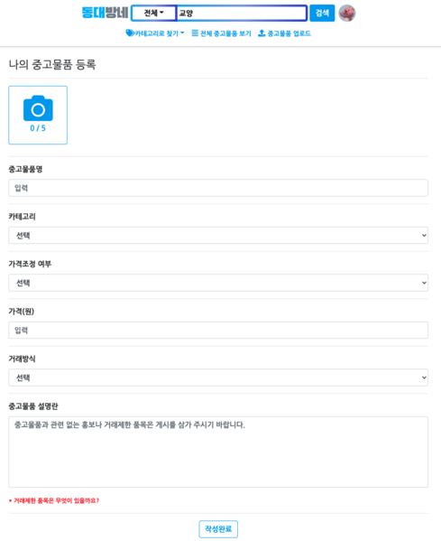
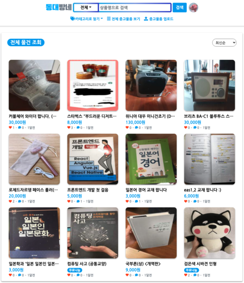
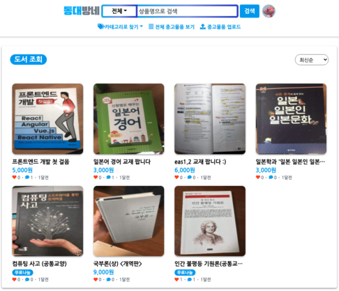
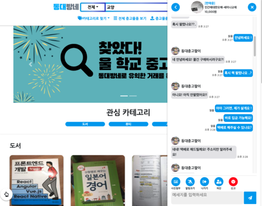
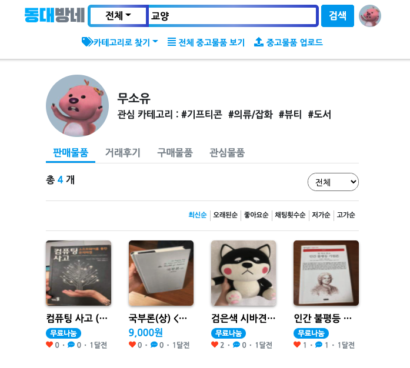

# 동대방네 

## | 프로젝트 소개 (2020/12 ~ 2021/6)

동국대학교 학생 및 교직원을 대상으로한 중고거래 플랫폼 서비스입니다. | https://www.dgumarket.co.kr/ 

## | 주요 기능 

- ##### 중고 상품 업로드 (판매 목적)

- ##### 1:1 채팅 (문자, 텍스트)

- ##### 내 거래 정보 관리 

  - ###### 판매 물품

  - ###### 거래 후기 

  - ###### 구매 물품

  - ###### 관심 물품

- ##### 중고 상품 조회 

  - ###### 카테고리 기준

  - ###### 모든 중고물품 조회

  - ###### 검색 (상품 카테고리 + 검색 키워드)

## | 기술 스택 

`Spring Boot`, `Spring Security`, `Spring Cloud Gateway`, `Spring Data JPA`, `AWS EC2`, `AWS S3`, `AWS Lambda` `MySQL`, `Redis`, `Gitflow`

## | Screen Shot

​													 < 중고 상품 업로드 > 

​													 < 중고물품 조회 - 전체물건 조회 >

​													 < 중고물품 조회 - 카테고리 별 조회 중 '도서' >

​												 < 1:1 채팅으로 거래 > 		

​							  < 내 거래정보 관리 >. 										

